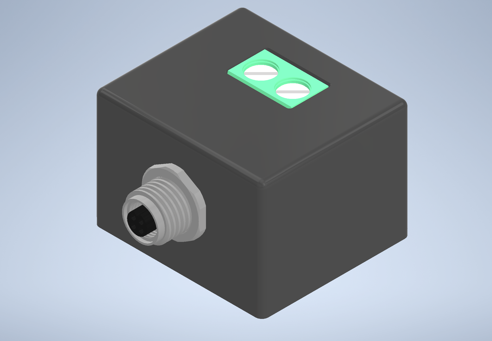
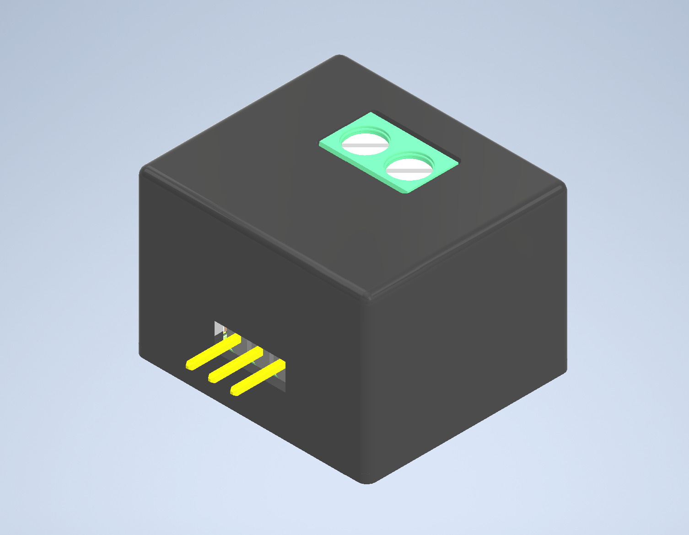
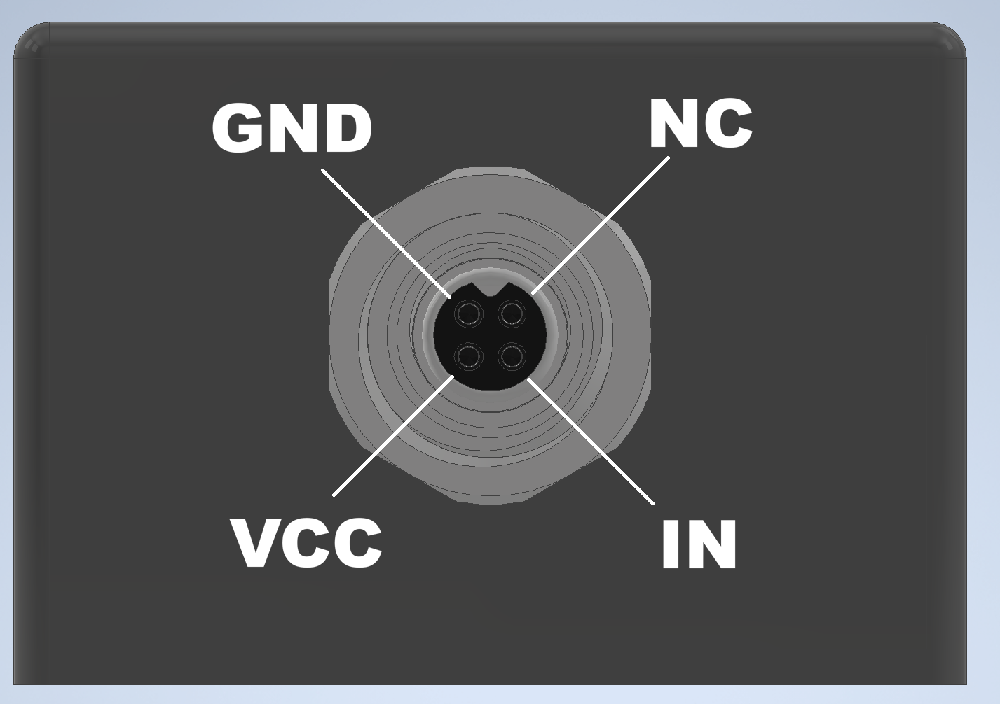

# FabLabs Valve Driver

Compact solenoid valve driver board with TTL control.

This board accepts a 3.3–5V TTL logic input and drives solenoid valves from a 5–40V supply. It is intended for lab automation and fluid-control applications that require a simple, robust valve driver with flexible connector options.

<table>
  <tr>
    <td></td>
    <td></td>
  </tr>
</table>

<!-- ## 🌐 View Online

### eCAD

View the complete electronic design project online via [Altium 365 Viewer](https://sainsburywellcomecentre.github.io/fablabs-documentation/#fablabs-valve-driver) -->

## Electrical Specifications

- **Logic Input Voltage**: 3.3–5V TTL (0V low, 3.3–5V high)
- **Driver Output Voltage**: 5–40V (follows power supply voltage)
- **Maximum Load Current**: 1.5A
- **Logic Input Impedance**: 10kΩ
- **Response Time**: <1ms (typical MOSFET switching)
- **Connector options:** M5 circular connector or pin-header options available for logic input and power

## Pin Definitions

<table>
  <tr>
    <td></td>
    <td></td>
    <td></td>
  </tr>
</table>

## Build your own

Check out the **[latest release](https://github.com/SainsburyWellcomeCentre/fablabs-valve-driver/releases/latest)** for complete production files and instructions to build your own valve driver.

## 💻 Software Requirements

To access the source design files:

- **Altium Designer 24** or newer  
  Academic licenses available via [Altium Education](https://www.altium.com/education/)

- **Autodesk Inventor Pro 2025** or newer  
  Academic licenses via [Autodesk Education](https://www.autodesk.com/education/home)

## 📜 License

**Sainsbury Wellcome Centre hardware is released under** [Creative Commons Attribution-ShareAlike 4.0 International](http://creativecommons.org/licenses/by-sa/4.0/).

You are free to:

- **Share** — copy and redistribute the material in any medium or format
- **Adapt** — remix, transform, and build upon the material for any purpose

Under the following terms:

- **Attribution** — Give appropriate credit, link to the license, and indicate changes.
- **ShareAlike** — Distribute your contributions under the same license.
- **No additional restrictions** — Don’t apply legal or technological measures that prevent others from doing anything the license permits.

> For the full legal text, see [LICENSE](LICENSE).

## ❤ Contributors

 

## 📧 Contact

- **Author**: [@DCisHurt](https://github.com/DCisHurt)
- **Email**: [yuhsuan.chen@ucl.ac.uk](mailto:yuhsuan.chen@ucl.ac.uk)
- **Website**: [FabLabs](https://sainsburywellcomecentre.github.io/fablabs-documentation/#fablabs-valve-driver)
